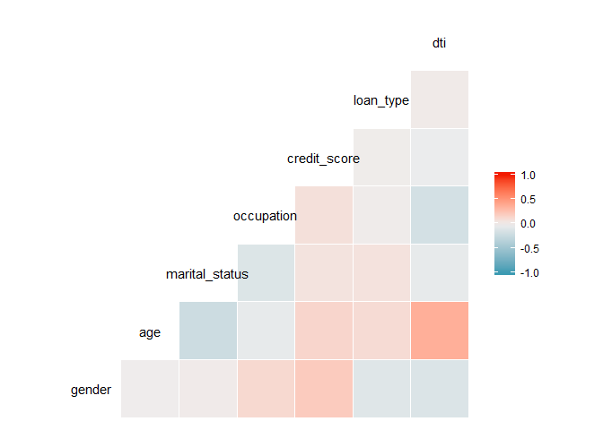
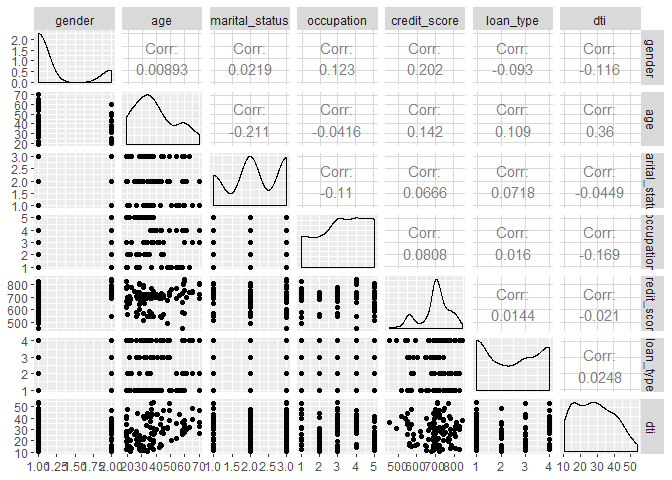
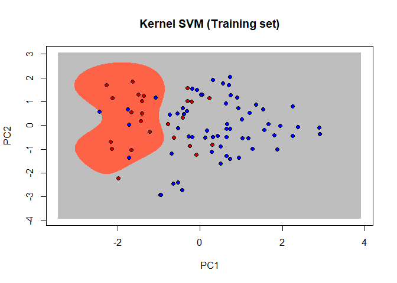
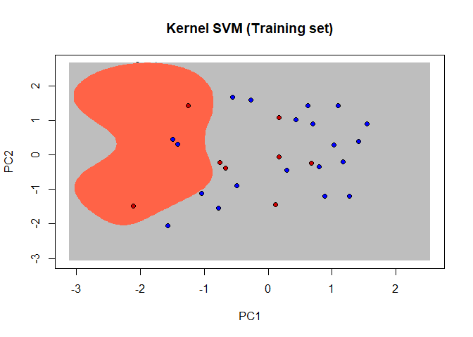
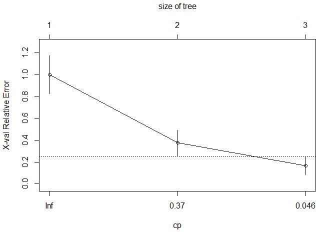
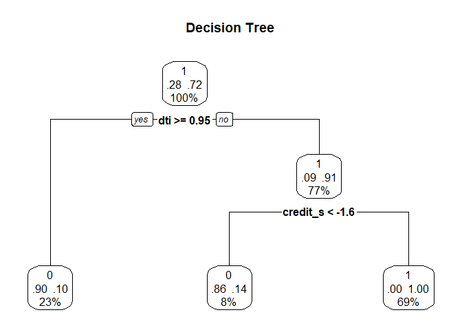

Loan Approval Prediction by using Kernel SVM, Decision Tree and Random
Forest Models
================

``` r
df <- read.csv("customer_loan_prediction.csv")
```

``` r
# Print the structure of the dataframe
str(df)
```

    ## 'data.frame':    114 obs. of  12 variables:
    ##  $ applicantId       : Factor w/ 87 levels "004NZMX60E","017STAOLDV",..: 1 1 2 3 4 5 6 6 6 7 ...
    ##  $ state             : Factor w/ 34 levels "AK","AL","AR",..: 4 4 23 23 7 22 23 23 23 26 ...
    ##  $ gender            : Factor w/ 2 levels "Female","Male": 2 2 1 2 2 2 1 1 1 2 ...
    ##  $ age               : int  36 36 34 48 32 44 60 60 60 48 ...
    ##  $ race              : Factor w/ 7 levels "American Indian or Alaska Native",..: 5 5 7 5 7 6 2 2 2 1 ...
    ##  $ marital_status    : Factor w/ 3 levels "Divorced","Married",..: 2 2 2 2 3 3 3 3 3 2 ...
    ##  $ occupation        : Factor w/ 5 levels "Accout","Business",..: 5 5 3 1 2 1 4 4 4 1 ...
    ##  $ credit_score      : int  710 720 720 670 720 540 840 824 824 490 ...
    ##  $ income            : num  9371 9371 9010 6538 8679 ...
    ##  $ debts             : num  2000 3014 1000 2099 1000 ...
    ##  $ loan_type         : Factor w/ 4 levels "Auto","Credit",..: 4 1 2 3 3 4 4 1 2 4 ...
    ##  $ loan_decision_type: Factor w/ 3 levels "Approved","Denied",..: 1 1 1 1 1 2 1 1 1 2 ...

``` r
head(df)
```

    ##   applicantId state gender age            race marital_status occupation
    ## 1  004NZMX60E    CA   Male  36 No co-applicant        Married       NYPD
    ## 2  004NZMX60E    CA   Male  36 No co-applicant        Married       NYPD
    ## 3  017STAOLDV    OH Female  34           White        Married         IT
    ## 4  017WEFEN7S    OH   Male  48 No co-applicant        Married     Accout
    ## 5  01FSKXYCRD    FL   Male  32           White         Single   Business
    ## 6  024LVUJ6HV    NY   Male  44  Not applicable         Single     Accout
    ##   credit_score   income   debts loan_type loan_decision_type
    ## 1          710 9371.333 2000.00  Personal           Approved
    ## 2          720 9371.333 3013.82      Auto           Approved
    ## 3          720 9010.250 1000.00    Credit           Approved
    ## 4          670 6538.000 2099.00      Home           Approved
    ## 5          720 8679.417 1000.00      Home           Approved
    ## 6          540 6238.000 2500.00  Personal             Denied

``` r
# Check for the NA values
any(is.na(df))
```

    ## [1] FALSE

There are no NA values in this dataset.

# We need debt/income proportion. So we create a new variable as “dti”

``` r
# Calculating DTI
df$dti <- (df$debts/df$income)*100
```

# Create loan\_decision\_status variable which is our target variable to use for loan prediction

``` r
df$loan_decision_status <- ifelse(df$loan_decision_type == 'Denied', 0, 1)
str(df)
```

    ## 'data.frame':    114 obs. of  14 variables:
    ##  $ applicantId         : Factor w/ 87 levels "004NZMX60E","017STAOLDV",..: 1 1 2 3 4 5 6 6 6 7 ...
    ##  $ state               : Factor w/ 34 levels "AK","AL","AR",..: 4 4 23 23 7 22 23 23 23 26 ...
    ##  $ gender              : Factor w/ 2 levels "Female","Male": 2 2 1 2 2 2 1 1 1 2 ...
    ##  $ age                 : int  36 36 34 48 32 44 60 60 60 48 ...
    ##  $ race                : Factor w/ 7 levels "American Indian or Alaska Native",..: 5 5 7 5 7 6 2 2 2 1 ...
    ##  $ marital_status      : Factor w/ 3 levels "Divorced","Married",..: 2 2 2 2 3 3 3 3 3 2 ...
    ##  $ occupation          : Factor w/ 5 levels "Accout","Business",..: 5 5 3 1 2 1 4 4 4 1 ...
    ##  $ credit_score        : int  710 720 720 670 720 540 840 824 824 490 ...
    ##  $ income              : num  9371 9371 9010 6538 8679 ...
    ##  $ debts               : num  2000 3014 1000 2099 1000 ...
    ##  $ loan_type           : Factor w/ 4 levels "Auto","Credit",..: 4 1 2 3 3 4 4 1 2 4 ...
    ##  $ loan_decision_type  : Factor w/ 3 levels "Approved","Denied",..: 1 1 1 1 1 2 1 1 1 2 ...
    ##  $ dti                 : num  21.3 32.2 11.1 32.1 11.5 ...
    ##  $ loan_decision_status: num  1 1 1 1 1 0 1 1 1 0 ...

``` r
# Encoding the target variable as factor
df$loan_decision_status <- factor(df$loan_decision_status, levels = c(0, 1))
```

``` r
#Selecting the required fields for prediction
customer_loan_refined <- df[,c(3,4,6:8,11,13:14)]
head(customer_loan_refined)
```

    ##   gender age marital_status occupation credit_score loan_type      dti
    ## 1   Male  36        Married       NYPD          710  Personal 21.34168
    ## 2   Male  36        Married       NYPD          720      Auto 32.15999
    ## 3 Female  34        Married         IT          720    Credit 11.09847
    ## 4   Male  48        Married     Accout          670      Home 32.10462
    ## 5   Male  32         Single   Business          720      Home 11.52151
    ## 6   Male  44         Single     Accout          540  Personal 40.07695
    ##   loan_decision_status
    ## 1                    1
    ## 2                    1
    ## 3                    1
    ## 4                    1
    ## 5                    1
    ## 6                    0

# Converting categorical variables to numeric

``` r
customer_loan_refined$gender <- as.numeric(factor(customer_loan_refined$gender,
                                                  levels = c('Male','Female'),
                                                  labels = c(1,2)))

customer_loan_refined$marital_status <- as.numeric(factor(customer_loan_refined$marital_status,
                                                          levels = c('Divorced','Married','Single'),
                                                          labels = c(1,2,3)))

customer_loan_refined$occupation <- as.numeric(factor(customer_loan_refined$occupation,
                                                      levels = c('Accout','Business','IT','Manager','NYPD'),
                                                      labels = c(1,2,3,4,5)))

customer_loan_refined$loan_type <- as.numeric(factor(customer_loan_refined$loan_type,
                                                     levels = c('Auto','Credit','Home','Personal'),
                                                     labels = c(1,2,3,4)))

head(customer_loan_refined)
```

    ##   gender age marital_status occupation credit_score loan_type      dti
    ## 1      1  36              2          5          710         4 21.34168
    ## 2      1  36              2          5          720         1 32.15999
    ## 3      2  34              2          3          720         2 11.09847
    ## 4      1  48              2          1          670         3 32.10462
    ## 5      1  32              3          2          720         3 11.52151
    ## 6      1  44              3          1          540         4 40.07695
    ##   loan_decision_status
    ## 1                    1
    ## 2                    1
    ## 3                    1
    ## 4                    1
    ## 5                    1
    ## 6                    0

# Correlation matrixes (understand the correlation between more than 2 variables)

``` r
library(GGally)
```

    ## Loading required package: ggplot2

    ## Registered S3 method overwritten by 'GGally':
    ##   method from   
    ##   +.gg   ggplot2

``` r
cor(customer_loan_refined[1:7])
```

    ##                      gender          age marital_status  occupation
    ## gender          1.000000000  0.008926435     0.02188653  0.12283562
    ## age             0.008926435  1.000000000    -0.21143733 -0.04158444
    ## marital_status  0.021886531 -0.211437329     1.00000000 -0.11021527
    ## occupation      0.122835625 -0.041584443    -0.11021527  1.00000000
    ## credit_score    0.202169300  0.142380921     0.06655779  0.08083772
    ## loan_type      -0.093002962  0.108969602     0.07177620  0.01603174
    ## dti            -0.116132641  0.360381737    -0.04493853 -0.16856383
    ##                credit_score   loan_type         dti
    ## gender           0.20216930 -0.09300296 -0.11613264
    ## age              0.14238092  0.10896960  0.36038174
    ## marital_status   0.06655779  0.07177620 -0.04493853
    ## occupation       0.08083772  0.01603174 -0.16856383
    ## credit_score     1.00000000  0.01444749 -0.02099488
    ## loan_type        0.01444749  1.00000000  0.02478509
    ## dti             -0.02099488  0.02478509  1.00000000

``` r
ggcorr(customer_loan_refined[1:7])
```

<!-- -->

``` r
ggpairs(customer_loan_refined[1:7])
```

<!-- -->

As you see at the graph above there are no variable has high
correlation. Which is good against overfitting problem.

# Splitting the customer\_loan\_refined dataset into training and test sets

``` r
#library(caTools)
#set.seed(123)
#split = sample.split(customer_loan_refined$loan_decision_status, SplitRatio = 0.70)
#training_set = subset(customer_loan_refined, split == TRUE)
#test_set = subset(customer_loan_refined, split == FALSE)
```

# Splitting the customer\_loan\_refined dataset into training and test sets

``` r
library(caTools)
set.seed(123)
split = sample.split(customer_loan_refined$loan_decision_status, SplitRatio = 0.75)
training_set = subset(customer_loan_refined, split == TRUE)
test_set = subset(customer_loan_refined, split == FALSE)
```

# Understand the data

``` r
library(funModeling)
```

    ## Loading required package: Hmisc

    ## Loading required package: lattice

    ## Loading required package: survival

    ## Loading required package: Formula

    ## 
    ## Attaching package: 'Hmisc'

    ## The following objects are masked from 'package:base':
    ## 
    ##     format.pval, units

    ## funModeling v.1.9.3 :)
    ## Examples and tutorials at livebook.datascienceheroes.com
    ##  / Now in Spanish: librovivodecienciadedatos.ai

    ## 
    ## Attaching package: 'funModeling'

    ## The following object is masked from 'package:GGally':
    ## 
    ##     range01

``` r
profiling_num(customer_loan_refined)
```

    ##         variable       mean    std_dev variation_coef     p_01      p_05
    ## 1         gender   1.201754  0.4030816      0.3354110   1.0000   1.00000
    ## 2            age  38.877193 14.3256317      0.3684842  19.0000  19.00000
    ## 3 marital_status   2.140351  0.7743361      0.3617800   1.0000   1.00000
    ## 4     occupation   3.271930  1.3843953      0.4231128   1.0000   1.00000
    ## 5   credit_score 695.824561 78.9530213      0.1134669 493.9000 550.00000
    ## 6      loan_type   2.447368  1.2486602      0.5102052   1.0000   1.00000
    ## 7            dti  28.240960 11.4179789      0.4043056  11.1113  12.08831
    ##        p_25      p_50      p_75      p_95      p_99    skewness kurtosis
    ## 1   1.00000   1.00000   1.00000   2.00000   2.00000  1.48636099 3.209269
    ## 2  28.00000  36.50000  48.00000  65.00000  70.00000  0.55051603 2.356827
    ## 3   2.00000   2.00000   3.00000   3.00000   3.00000 -0.24588054 1.717408
    ## 4   2.00000   3.00000   4.00000   5.00000   5.00000 -0.29469931 1.886057
    ## 5 672.50000 702.00000 740.00000 807.40000 824.00000 -0.75226407 3.300146
    ## 6   1.00000   2.50000   4.00000   4.00000   4.00000  0.03805546 1.380708
    ## 7  17.12604  27.28488  37.11003  46.95071  52.74253  0.25245813 2.050566
    ##        iqr                             range_98
    ## 1  0.00000                               [1, 2]
    ## 2 20.00000                             [19, 70]
    ## 3  1.00000                               [1, 3]
    ## 4  2.00000                               [1, 5]
    ## 5 67.50000                         [493.9, 824]
    ## 6  3.00000                               [1, 4]
    ## 7 19.98399 [11.1113011715528, 52.7425300144433]
    ##                               range_80
    ## 1                               [1, 2]
    ## 2                           [20.3, 60]
    ## 3                               [1, 3]
    ## 4                               [1, 5]
    ## 5                         [563, 788.3]
    ## 6                               [1, 4]
    ## 7 [13.4914223938849, 43.9015282355941]

Since the difference of std\_deviations of the variables are too high,
we should scale the veriables for better prediction

# Applying Feature Scaling

``` r
#Scale all variables other than dependent variable which is 8th column of the table
training_set[-8] = scale(training_set[-8])
test_set[-8] = scale(test_set[-8])
```

Dimensionality Reduction using PCA As there are more than two
independent variables in customer data, it is difficult to plot chart as
two dimensions are needed to better visualize how Machine Learning
models work.

To reduce dimensions, perform the following:

Apply Dimensionality Reduction technique using Principal Component
Analysis (PCA) on customer dataset except on dependent variable and
reduce it to two dimensions. Before applying PCA, install and load caret
package.

# Applying PCA

``` r
# install.packages('caret')  http://topepo.github.io/caret/index.html
library(caret)
```

    ## Warning: package 'caret' was built under R version 3.6.2

    ## 
    ## Attaching package: 'caret'

    ## The following object is masked from 'package:survival':
    ## 
    ##     cluster

``` r
# install.packages('e1071')
library(e1071)
```

    ## 
    ## Attaching package: 'e1071'

    ## The following object is masked from 'package:Hmisc':
    ## 
    ##     impute

``` r
pca = preProcess(x = training_set[-8], method = 'pca', pcaComp = 2)
training_set = predict(pca, training_set)
training_set = training_set[c(2, 3, 1)]
test_set = predict(pca, test_set)
test_set = test_set[c(2, 3, 1)]
```

## 1- Fitting SVM to the Training set

Many machine learning models will get into over fitting problem by using
the higher dimensions. This is not the problem with SVM as decision
boundary is obtained using the samples nearest to the boundary. The use
of kernal with regularization gives better performance.

``` r
# install.packages('e1071')
library(e1071)
classifier = svm(formula = loan_decision_status ~ .,
                 data = training_set,
                 type = 'C-classification',
                 kernel = 'radial')
```

# Predicting the Test set results

``` r
y_pred = predict(classifier, newdata = test_set[-3])
```

``` r
# Making the Confusion Matrix
cm = table(test_set[, 3], y_pred)
accuracy = (cm[1,1] + cm[2,2]) / (cm[1,1] + cm[2,2] + cm[1,2] + cm[2,1])
accuracy
```

    ## [1] 0.6428571

# Applying k-Fold Cross Validation

``` r
##install.packages('caret')
library(caret)
folds = createFolds(training_set$loan_decision_status, k = 10)
cv = lapply(folds, function(x) {
  training_fold = training_set[-x, ]
  test_fold = training_set[x, ]
  classifier = svm(formula = loan_decision_status ~ .,
                   data = training_fold,
                   type = 'C-classification',
                   kernel = 'radial')
  y_pred = predict(classifier, newdata = test_fold[-3])
  cm = table(test_fold[, 3], y_pred)
  accuracy = (cm[1,1] + cm[2,2]) / (cm[1,1] + cm[2,2] + cm[1,2] + cm[2,1])
  return(accuracy)
})
accuracy = mean(as.numeric(cv))
```

As you see the accuracy value is higher than before. After the cross
validation we have a better model.

# Applying Grid Search to find the best parameters

``` r
# install.packages('caret')
library(caret)
classifier = train(form = loan_decision_status ~ ., data = training_set, method = 'svmRadial')
classifier
```

    ## Support Vector Machines with Radial Basis Function Kernel 
    ## 
    ## 86 samples
    ##  2 predictor
    ##  2 classes: '0', '1' 
    ## 
    ## No pre-processing
    ## Resampling: Bootstrapped (25 reps) 
    ## Summary of sample sizes: 86, 86, 86, 86, 86, 86, ... 
    ## Resampling results across tuning parameters:
    ## 
    ##   C     Accuracy   Kappa    
    ##   0.25  0.7620981  0.2298284
    ##   0.50  0.7644285  0.3197755
    ##   1.00  0.7630118  0.3609996
    ## 
    ## Tuning parameter 'sigma' was held constant at a value of 1.423942
    ## Accuracy was used to select the optimal model using the largest value.
    ## The final values used for the model were sigma = 1.423942 and C = 0.5.

``` r
classifier$bestTune  # burada buldugumuz sigma c degerlerini yukardaki classifier olan yerde parametre olarak manuel girip oradaki classifieri da kullanabiliriz. ama bunu da direk kullanabiliriz.
```

    ##      sigma   C
    ## 2 1.423942 0.5

# Now we have a new classifier which is tuned. Let’s have look at the new model and it’s accuracy.

``` r
y_pred = predict(classifier, newdata = test_set[-3])
cm = table(test_set[, 3], y_pred)
accuracy = (cm[1,1] + cm[2,2]) / (cm[1,1] + cm[2,2] + cm[1,2] + cm[2,1])
accuracy
```

    ## [1] 0.7142857

As you see the accuracy value is higher than before. After the cross
validation and grid search we have predictions with better accuracy.

``` r
# Visualising the Training set results
library(ElemStatLearn)
```

    ## Warning: package 'ElemStatLearn' was built under R version 3.6.2

``` r
set = training_set
X1 = seq(min(set[, 1]) - 1, max(set[, 1]) + 1, by = 0.01)
X2 = seq(min(set[, 2]) - 1, max(set[, 2]) + 1, by = 0.01)

grid_set = expand.grid(X1, X2)
colnames(grid_set) = c('PC1', 'PC2')
y_grid = predict(classifier, newdata = grid_set)
plot(set[, -3],
     main = 'Kernel SVM (Training set)',
     xlab = 'PC1', ylab = 'PC2',
     xlim = range(X1), ylim = range(X2))
contour(X1, X2, matrix(as.numeric(y_grid), length(X1), length(X2)), add = TRUE)
points(grid_set, pch = '.', col = ifelse(y_grid == 1, 'gray', 'tomato'))
points(set, pch = 21, bg = ifelse(set[, 3] == 1, 'blue', 'red3'))
```

<!-- -->

``` r
# Visualising the Test set results
library(ElemStatLearn)
set = test_set
X1 = seq(min(set[, 1]) - 1, max(set[, 1]) + 1, by = 0.01)
X2 = seq(min(set[, 2]) - 1, max(set[, 2]) + 1, by = 0.01)
grid_set = expand.grid(X1, X2)
colnames(grid_set) = c('PC1', 'PC2')
y_grid = predict(classifier, newdata = grid_set)
plot(set[, -3],
     main = 'Kernel SVM (Training set)',
     xlab = 'PC1', ylab = 'PC2',
     xlim = range(X1), ylim = range(X2))
contour(X1, X2, matrix(as.numeric(y_grid), length(X1), length(X2)), add = TRUE)
points(grid_set, pch = '.', col = ifelse(y_grid == 1, 'gray', 'tomato'))
points(set, pch = 21, bg = ifelse(set[, 3] == 1, 'blue', 'red3'))
```

<!-- -->

# 2- Fitting Decision Tree Classification to the Training set

# Splitting the customer\_loan\_refined dataset into training and test sets

We are here split the dataset again. We won’t apply PCA for this time.

``` r
library(caTools)
set.seed(123)
split = sample.split(customer_loan_refined$loan_decision_status, SplitRatio = 0.75)
training_set = subset(customer_loan_refined, split == TRUE)
test_set = subset(customer_loan_refined, split == FALSE)
```

# Applying Feature Scaling

``` r
#Scale all variables other than dependent variable which is 8th column of the table
training_set[-8] = scale(training_set[-8])
test_set[-8] = scale(test_set[-8])
```

Decision trees create a set of binary splits on the predictor variables
in order to create a tree that can be used to classify new observations
into one of two groups. Here, we will be using classical trees.

``` r
# install.packages('rpart')
library(rpart)

dtree <- rpart(formula = loan_decision_status ~ .,
               method="class",
               data=training_set,
               parms=list(split="information"))
dtree$cptable
```

    ##          CP nsplit rel error    xerror       xstd
    ## 1 0.6666667      0 1.0000000 1.0000000 0.17331693
    ## 2 0.2083333      1 0.3333333 0.3750000 0.11827859
    ## 3 0.0100000      2 0.1250000 0.1666667 0.08137227

To choose the final tree size, we need to choose the smallest tree whose
cross-validated error (xerror) is within one standard error of the
minimum cross-validated error value. From the cptable, a tree with one
splits has a complexity parameter of 0.0100000 , so the statement
prune(dtree, cp=0.0100000 ) returns a tree with the desired size.

``` r
plotcp(dtree)
```

<!-- -->

# Visualize decision tree

``` r
dtree.pruned <- prune(dtree, cp= 0.0100000 )
library(rpart.plot)
prp(dtree.pruned, type = 2, extra = 104,
    fallen.leaves = TRUE, main="Decision Tree")
```

<!-- -->
We have then plotted the tree: pruned tree for predicting the loan
status

``` r
dtree.pred <- predict(dtree.pruned, training_set, type="class")
```

Confusion matrix

``` r
dtree.perf <- table(training_set$loan_decision_status, dtree.pred,
                    dnn=c("Actual", "Predicted"))
dtree.perf
```

    ##       Predicted
    ## Actual  0  1
    ##      0 24  0
    ##      1  3 59

Finally, we ran the confusion table to know the accuracy of the model

``` r
accuracy_dt = (dtree.perf[1,1] + dtree.perf[2,2]) / (dtree.perf[1,1] + dtree.perf[2,2] + dtree.perf[1,2] + dtree.perf[2,1])
accuracy_dt
```

    ## [1] 0.9651163

Accuracy: Train data: 96.51%. Results show better performance than the
Kernel SVM model.

In R, decision trees can be grown and pruned using the rpart() function
and prune() function in the rpart package. First, the tree is grown
using the rpart() function. We printed the tree and the summary to
examine the fitted model. The tree may be too large and need to be
pruned. To choose a final tree size, examine the cptable of the list
returned by rpart(). It contains data about the prediction error for
different tree sizes. The complexity parameter (cp) is used to penalize
larger trees.

# 3.1 -Fitting Random Classification to the Training set

``` r
library(randomForest) 
```

    ## randomForest 4.6-14

    ## Type rfNews() to see new features/changes/bug fixes.

    ## 
    ## Attaching package: 'randomForest'

    ## The following object is masked from 'package:ggplot2':
    ## 
    ##     margin

``` r
set.seed(42) 
fit.forest <- randomForest(loan_decision_status ~ ., data=training_set,
                           na.action=na.roughfix,
                           importance=TRUE)
fit.forest
```

    ## 
    ## Call:
    ##  randomForest(formula = loan_decision_status ~ ., data = training_set,      importance = TRUE, na.action = na.roughfix) 
    ##                Type of random forest: classification
    ##                      Number of trees: 500
    ## No. of variables tried at each split: 2
    ## 
    ##         OOB estimate of  error rate: 4.65%
    ## Confusion matrix:
    ##    0  1 class.error
    ## 0 23  1  0.04166667
    ## 1  3 59  0.04838710

The random forest function grew 500 traditional decision trees by
sampling observations with replacement from the training sample. Random
forests provides natural measure of variable importance.

``` r
importance(fit.forest, type=2)
```

    ##                MeanDecreaseGini
    ## gender                 1.017847
    ## age                    2.886115
    ## marital_status         1.341113
    ## occupation             2.898591
    ## credit_score           7.443601
    ## loan_type              1.973179
    ## dti                   16.032839

The relative importance measure specified by type=2 option is the total
decrease in node impurities from splitting on that variable, averaged
over all trees. In our trees,the most important variable is “dti” and
the least is “gender”.

Creating Confusion matrix

``` r
forest.pred <- predict(fit.forest, training_set)
forest.perf <- table(training_set$loan_decision_status, forest.pred,
                     dnn=c("Actual", "Predicted"))
forest.perf
```

    ##       Predicted
    ## Actual  0  1
    ##      0 24  0
    ##      1  0 62

``` r
accuracy_rf = (forest.perf[1,1] + forest.perf[2,2]) / (forest.perf[1,1] + forest.perf[2,2] + forest.perf[1,2] + forest.perf[2,1])
accuracy_rf
```

    ## [1] 1

We have finally measured the accuracy for the training sample and
applied the prediction to the test sample. THe accuracy of random forest
with this model is %100. That means it has predicted all values
correctly.

Random forests tend to be very accurate compared to other classification
methods though. Also, they can handle large problems. Personally, I have
more confidence from the results generated from forest trees compared to
decision trees. One problem which might occur with single decision tree
is that it can overfit. Random forest, on the other hand, prevents
overfitting by creating random subsets of the variables and building
smaller trees using the subsets and then it combines the subtrees.

# 3.2 -Fitting Random Classification to the Test set

``` r
set.seed(42) 
fit.forest2 <- randomForest(loan_decision_status ~ ., data=test_set,
                           na.action=na.roughfix,
                           importance=TRUE)
fit.forest2
```

    ## 
    ## Call:
    ##  randomForest(formula = loan_decision_status ~ ., data = test_set,      importance = TRUE, na.action = na.roughfix) 
    ##                Type of random forest: classification
    ##                      Number of trees: 500
    ## No. of variables tried at each split: 2
    ## 
    ##         OOB estimate of  error rate: 10.71%
    ## Confusion matrix:
    ##   0  1 class.error
    ## 0 6  2        0.25
    ## 1 1 19        0.05

No. of variables tried at each split: 2

``` r
importance(fit.forest2, type=2)
```

    ##                MeanDecreaseGini
    ## gender                0.3537558
    ## age                   1.1681425
    ## marital_status        0.6275397
    ## occupation            0.6542818
    ## credit_score          3.8843623
    ## loan_type             0.7008703
    ## dti                   3.4658889

The most important variable is “credit score” (it is different from the
training set) and the least is “gender”.

Creating Confusion matrix

``` r
forest.pred2 <- predict(fit.forest2, test_set)
forest.perf2 <- table(test_set$loan_decision_status, forest.pred2,
                     dnn=c("Actual", "Predicted"))
forest.perf2
```

    ##       Predicted
    ## Actual  0  1
    ##      0  8  0
    ##      1  0 20

``` r
accuracy_rf = (forest.perf2[1,1] + forest.perf2[2,2]) / (forest.perf2[1,1] + forest.perf2[2,2] + forest.perf2[1,2] + forest.perf2[2,1])
accuracy_rf
```

    ## [1] 1

The accuracy of test has is also %100. The best predictions are made by
Random FOrest model in this case. As a result we should use random
forest predictions for this particular dataset for decision making
process.

So now, we have predictions for 114 customers who apply for loans with
accuracy of 100%. We can apply this method for any new data set to have
a prediction about their eligibility of getting a loan.
